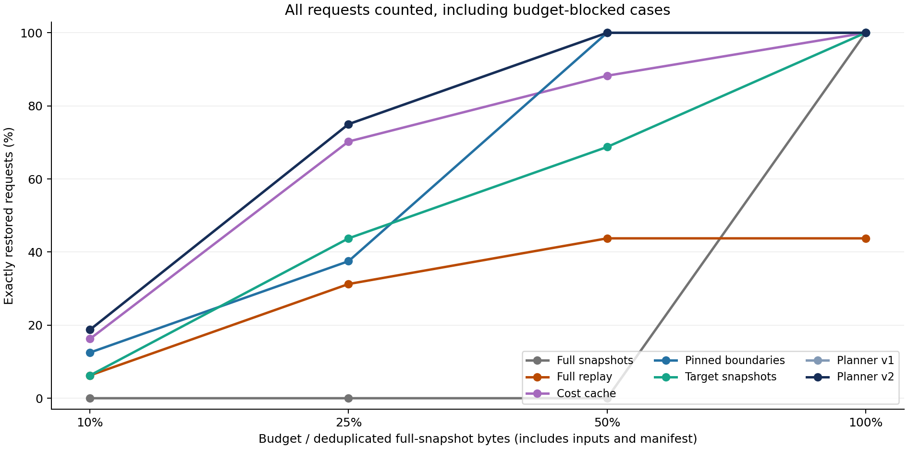
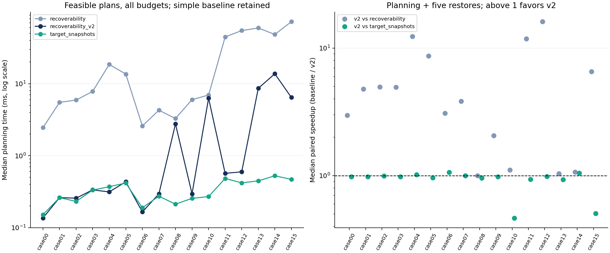
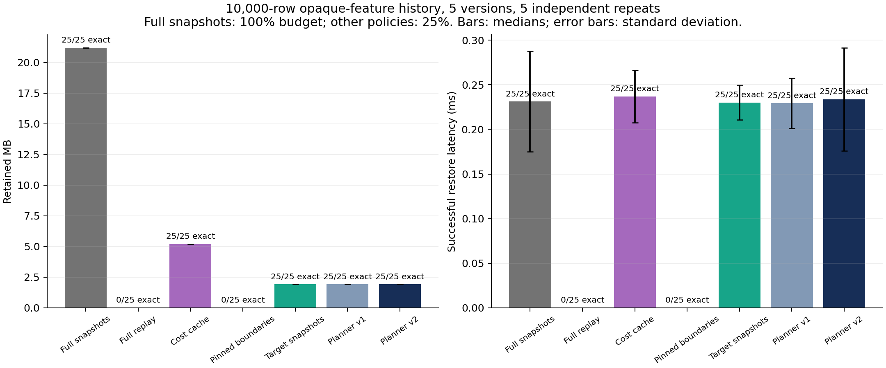
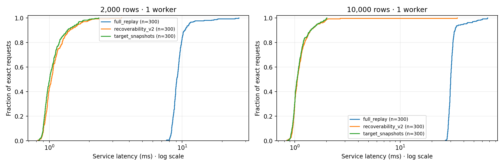

# RecoverML — Milestone 2

RecoverML helps a machine learning system save and restore earlier versions of its work.

[Open the public GitHub repository](https://github.com/Hannaancode/RecoverML)

## Simple summary

Machine learning pipelines create data blocks model states and result files.
RecoverML records these parts and the links between them and then chooses what to keep under a storage budget.
When an earlier version is requested RecoverML restores it from the saved parts and checks the saved artifact hashes.
This gives each version a clear recovery path and helps the system reuse data that is already available.

## What we have achieved

We built a working prototype with a complete benchmark harness and a version 2 planner.
The second experiment tested **11,200 requests** across **80 captured histories** and four storage budgets.
The planner restored **1,175 out of 1,175** admitted version requests with exact artifact matches.
On matched feasible histories version 2 gave a **19.3× median planning speedup** over version 1 and a **3.4× improvement** for planning plus five restores.
All **31 automated tests** passed and the audit checked the request and restoration traces.
The repository also contains the source code the raw CSV and JSONL logs the plots the reports and a captured replay example.
The fresh worker experiment restored **5400 out of 5400 requests** and saved real times and CPU and memory readings and latency plots

## Next plan

The next stage will extend RecoverML to more machine learning pipelines and more data types.
We will add wider workload cases and more real data and then run more repeated trials.
We will compare additional recovery policies and improve the user guide and the research evaluation.

## Measured results

The second experiment used five historical versions for each request and seven recovery policies.
The table shows complete history and budget selections and exact version requests.

| Policy | Complete history and budget selections | Exact version requests |
|---|---:|---:|
| Full deduplicated snapshots | 80 / 320 | 400 / 1,600 |
| Full replay | 100 / 320 | 500 / 1,600 |
| Cost-ranked cache | 210 / 320 | 1,099 / 1,600 |
| Pinned boundaries and cost cache | 200 / 320 | 1,000 / 1,600 |
| Direct target snapshots | 175 / 320 | 875 / 1,600 |
| Planner v1 | 235 / 320 | 1,175 / 1,600 |
| **Planner v2** | **235 / 320** | **1,175 / 1,600** |

### Recovery under storage budgets



### Planning cost and total cost



The report explains the case labels and the paired comparison.

### Storage and restoration time



This plot uses full snapshots at the 100 percent budget and the other policies at 25 percent.
The measured storage saving for direct target snapshots and version 2 is about 91 percent in this workload.

More results are available in the [planning overhead plot](results/iteration2/planning_overhead.png) and in the [raw requests](results/iteration2/raw_requests.csv), [execution traces](results/iteration2/execution_traces.jsonl), [retention plans](results/iteration2/retention_plans.jsonl), [paired comparisons](results/iteration2/paired_comparison.csv) and [audit](results/iteration2/audit.json).

## How RecoverML works

1. It records the pipeline graph the operator settings the environment and SHA-256 artifact identities.
2. It finds identical input blocks and intermediate artifacts and stores them once.
3. It protects the requested trained models and prediction outputs for each historical version.
4. It chooses retained artifacts under a byte budget.
5. Version 2 uses a direct target shortcut when it applies and otherwise uses a checked global optimization model.
6. It restores a version from the selected store and checks every loaded or rebuilt artifact hash.

The system keeps dependency information and replay information together so each recovery decision can be inspected.
The planner uses a read-cost model of 500 MB/s and 20 microseconds per blob together with measured capture times.

## Quick start

Use Python 3.12 and the dependencies in `requirements.txt`.

For one command that runs the tests and the storage check and the full worker experiment use

```bash
bash run_benchmarks.sh
```

This checks three policies at 1 and 2 and 4 workers and at two data sizes and repeats every setting three times
It saves real request times and CPU and memory samples and P50 P90 P99 values and plots
The worker experiment uses Linux and each worker uses one BLAS thread
An ordinary CPU computer or a Linux VM is enough

See the [rubric evidence](docs/RUBRIC_AUDIT.md) and the [fresh experiment report](docs/PERFORMANCE_REPORT.md)
See the [8 October improvements](docs/PROGRESS_OCT8.md) for stronger log checks and safe result folders and the latest test evidence
The [new results](results/rubric_oct7_final/performance) contain raw logs and a checked audit




```bash
python -m venv .venv
source .venv/bin/activate
python -m pip install -e .
python -m unittest discover -s tests -v
recoverml benchmark --config configs/smoke.json --out results/my_smoke
python -m recoverml.audit results/my_smoke
```

For the full experiment and plots run:

```bash
make iteration2
```

If the package is already installed use `PYTHONPATH=src` and run `python -m recoverml`.
The storage benchmark uses one BLAS thread and the new worker experiment tests 1 and 2 and 4 workers.
Each output directory is created as a new directory and `--resume` continues a completed checkpoint.
The one command runner refuses an existing output folder before starting any tests so earlier result files stay unchanged.

## Replay a captured history

The repository includes a complete small captured example in `examples/captured_history`.

```bash
recoverml select examples/captured_history --budget-bytes 2000000 --out work/retained
recoverml restore work/retained --version 0 --out work/restored_v0
```

The `select` command uses the captured metadata and copies the selected artifacts.
The `restore` command reads from that selected store and checks the restored files.

## Automated experiments

The preliminary experiment contains **6,600 request records**.
The second experiment adds five branching cases and contains **11,200 request records**.
Both experiments use five repeats four budgets and several historical versions.
They include logistic regression and random forest pipelines and workloads with 2,000 or 10,000 rows.
The public Wisconsin breast cancer dataset contains 569 rows and is used as one of the data sources.

The policies are:

- `full_snapshot` keeps all artifacts with content deduplication.
- `full_replay` keeps the required inputs and rebuilds the pipeline.
- `cost_cache` ranks artifacts by operation cost and size.
- `pinned_cost` also keeps replay boundary artifacts.
- `target_snapshots` keeps requested targets directly.
- `recoverability` uses a coverage-aware greedy planner.
- `recoverability_v2` uses the guarded shortcut or the global optimization planner and is the default for `select`.

See [docs/PLANNER_V2.md](docs/PLANNER_V2.md) for the planner formulation and the cost model.

## Results and project files

Read the [Iteration 2 report](docs/ITERATION2_REPORT.md) and the [preliminary report](docs/PRELIMINARY_REPORT.md) for the full experiment details.

The repository includes:

- Source code in `src/recoverml`
- Configuration files in `configs`
- Unit tests in `tests`
- Raw requests and operation traces in `results/preliminary` and `results/iteration2`
- Selection plans audit files environment records and summaries
- PNG performance plots and CSV comparison tables
- A captured replay example in `examples/captured_history`
- The automated workflow in `.github/workflows/tests.yml`
- SHA-256 entries for every project file in `CHECKSUMS.json`

Run the audit with:

```bash
python -m recoverml.audit results/my_preliminary
```

Run `make iteration2` to create a new complete experiment with plots audits paired comparisons and planner checks.

## Research references

- LIMA, SIGMOD 2021: https://mboehm7.github.io/resources/sigmod2021a_lima.pdf
- Helix, PVLDB 2019: https://www.vldb.org/pvldb/vol12/p446-xin.pdf
- Kishu, PVLDB 18(4): https://www.vldb.org/pvldb/vol18/p970-li.pdf
- ElasticNotebook: https://arxiv.org/abs/2309.11083
- ExoFlow, OSDI 2023: https://www.usenix.org/system/files/osdi23-zhuang.pdf
- Wisconsin dataset: https://scikit-learn.org/stable/modules/generated/sklearn.datasets.load_breast_cancer.html
- Randomness in scikit-learn: https://scikit-learn.org/stable/common_pitfalls.html#controlling-randomness

## Milestone 2 status

The working prototype the automated benchmark harness the raw logs the performance plots the reports and the instructor review guide are all included in this public repository.
See [docs/SUBMISSION.md](docs/SUBMISSION.md) for the reproduction steps and the full deliverable list.
