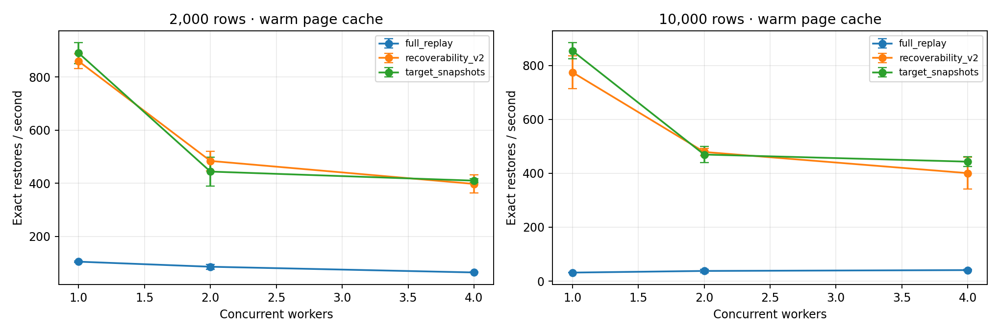

# RecoverML — Milestone 2

RecoverML helps a machine learning pipeline save space and restore earlier versions of its work

It records the data and model files and the links between them and stores identical parts once
The planner chooses what to keep within a storage budget and restores old models and predictions from saved files or recorded steps
Every loaded or rebuilt artifact is checked against its original SHA-256 fingerprint

## What we have achieved

We built a working Python prototype and an automated benchmark and faster version 2 and version 3 planners
The storage study tested 11200 requests across 80 histories and version 2 restored all 1175 admitted requests exactly
On matched feasible histories planning was 19.3 times faster than version 1 and planning plus five restores was 3.4 times faster
The worker experiment restored all 5400 requests exactly and recorded real times and CPU and memory use
The new public data study tested 3600 requests across 24 Digits and Wine histories and version 3 restored all 535 admitted requests exactly
Version 3 reduced the opaque solver model from 129 variables to 98 and its repeated planner study measured a 1.18 times median history speedup over version 2
The latest suite has 33 passing automated tests and the raw measurements and plots are included

## Start here

| What you need | Where to look |
|---|---|
| Instructor review and reproduction | [Submission guide](docs/SUBMISSION.md) |
| Evidence for each rubric requirement | [Rubric checklist](docs/RUBRIC_AUDIT.md) |
| All experiments and their files | [Results guide](results/README.md) |
| Latest throughput and latency analysis | [Performance report](docs/reports/PERFORMANCE_REPORT.md) |
| Storage coverage and planner comparison | [Iteration 2 report](docs/reports/ITERATION2_REPORT.md) |
| How the planner works | [Planner design](docs/PLANNER_V2.md) |
| Research sources for the next stage | [References](docs/REFERENCES.md) |
| Latest code improvements | [8 October progress](docs/history/PROGRESS_OCT8.md) |
| Current experiments and research decisions | [Research progress](docs/reserach_progress.txt) |

## Project layout

| Folder | Purpose |
|---|---|
| src/recoverml | Working capture and planning and restoration code |
| tests | Correctness and trace validation and runner tests |
| configs | Settings for smoke and performance and earlier experiments |
| scripts | Packaging and extra latency analysis tools |
| examples | Complete small captured history for replay |
| docs | Submission guide and rubric checklist and design and reports |
| results/milestone2 | Current performance and storage evidence and plots |
| results/archive | Earlier experiments and their complete submitted logs |
| results/validation | Dated test logs and later audit checks |
| results/runs | New local runs created by the runner and excluded from Git |

CHECKSUMS.json records the SHA-256 values for submitted files
The GitHub Actions workflow runs correctness checks and a smoke experiment on every push

## Run the project

Use Python 3.12 and Linux or WSL for CPU and memory tracing

```bash
python -m venv .venv
source .venv/bin/activate
python -m pip install -e .
bash run_benchmarks.sh
```

The runner tests three policies at two data sizes and 1 and 2 and 4 workers and repeats each setting three times
It creates a new folder under results/runs and saves tests and storage checks and performance logs and plots
Use an explicit new folder when needed

```bash
bash run_benchmarks.sh results/runs/my_experiment
```

An existing folder is refused before any tests start so earlier evidence stays unchanged
An ordinary CPU computer or Linux VM is enough

## Review the supplied evidence

```bash
PYTHONPATH=src python -m recoverml.performance --audit-only --out results/milestone2/performance
PYTHONPATH=src python -m recoverml.audit results/milestone2/storage
```




The results guide links the earlier storage and planning plots and every raw log group
The performance report explains queue wait and slower cases and measurement scope

## Replay an example

```bash
recoverml select examples/captured_history --budget-bytes 2000000 --out work/retained
recoverml restore work/retained --version 0 --out work/restored_v0
```

The example records its original environment and restoration checks that environment
A fresh local benchmark captures histories using the installed environment

## Next plan

Repeat the benchmark on the submission machine and compare the measured results
Profile environment validation and trace logging and then test useful performance changes
Add wider branching and opaque workloads and more data and keep real progress commits with their validation
Repeat the version 3 study on another machine and add larger graphs and more public datasets
The earlier configurations and reports and raw measurements remain available for that work

[Public repository](https://github.com/Hannaancode/RecoverML)
